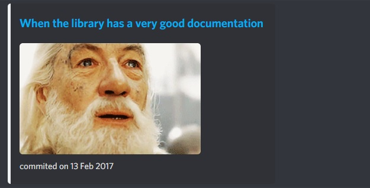

# Discord-Bot-Thecodinglove
> The coding love, epic GIFS for developers! 

```
the_coding_love();
les_joies_du_code();
```

## Overview

Discord bot that sends you random posts from The Coding Love also known as "Les Joies du Code".




### Implementation details

Simple NodeJS script parsing html from the coding love random post generator.  
Data is sent with a Discord Webhook.

```
# thecodinglove
https://thecodinglove.com/random
# lesjoiesducode
https://lesjoiesducode.fr/random
```

## How to use

### Create a Webhook

You will need to set the following environment variable : `DISCORD_WEBHOOK_URL`

To get your webhook url, have a look to the discord documentation to know how to create one : [Intro to Webhooks](https://support.discord.com/hc/en-us/articles/228383668-Intro-to-Webhooks)

### How to run

```
cd discord-bot-thecodinglove
npm install
DISCORD_WEBHOOK_URL=<discord_webhook_url> node src/index.js
```

### How to deploy

This is up to you !

You can simply schedule it with a cron job :
```
15 9 * * 1-5 DISCORD_WEBHOOK_URL=<discord_webhook_url> node discord-bot-thecodinglove/src/index.js > /var/log/discord-bot-thecodinglove/thecodinglove_$(date +\%Y\%m\%d_\%H:\%M:\%S\%z).log 2>&1
```

### Docker

```
# Build the docker image
docker build -t discord-bot-thecodinglove .
# Run the container
docker run --rm  -e DISCORD_WEBHOOK_URL=<discord_webhook_url> discord-bot-thecodinglove
# Run the container interactively
docker run -it --rm discord-bot-thecodinglove bash
```

Available on [Docker Hub](https://hub.docker.com/r/adelehedde/discord-bot-thecodinglove)

